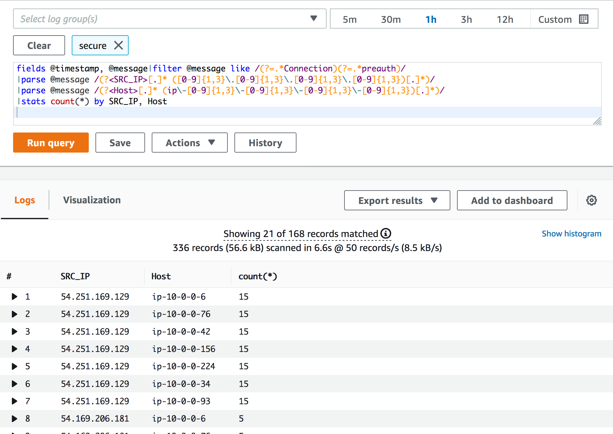

# Monitor and respond to security events in Amazon EC2 instances using Security Hub and CloudWatch Logs Insights

[Amazon Web Services (AWS)](http://aws.amazon.com/) customers use [AWS Security Hub](https://aws.amazon.com/security-hub) for monitoring, responding to, and remediating security findings in their environments. This post shows how security events recorded in log files across multiple [Amazon Elastic Compute Cloud (Amazon EC2)](https://aws.amazon.com/ec2/) instances can be identified, aggregated, and imported into Security Hub as findings. 

The example scenario used here shows how the IP addresses of systems that are the source of unauthorized attempts to gain access to Amazon EC2 instances can be identified and published in Security Hub. The solution uses:  
* [Amazon CloudWatch Logs Insights](https://docs.aws.amazon.com/AmazonCloudWatch/latest/logs/AnalyzingLogData.html) to query log data and identify security events recorded in instances that are subject to unauthorized access attempts. 
* [Custom product integration](https://docs.aws.amazon.com/securityhub/latest/userguide/securityhub-custom-providers.html) to import findings into Security Hub where they can be monitored and remediated by the security team. 
 
The entire process from detecting security events to publishing an aggregated finding in Security Hub is automated using [AWS Lambda](https://aws.amazon.com/lambda/).

## Overview of the example scenario and the solution
To walk through the solution, use the example scenario described in the following figure. In the example, there are seven Amazon EC2 instances running on the AWS cloud. Attempts at unauthorized access are coming from three different systems.
  


<sub>Figure 1: Architecture diagram of the solution</sub>  

These attempts are recorded on the Amazon EC2 instances in the /var/log/secure file on each instance, as shown in the following figure


<sub>Figure 2: Amazon EC2 instance log file /var/log/secure showing error messages that indicate a possible security event</sub>

Similar events are recorded in the log files of all the Amazon EC2 instances that are potentially being targeted. Using CloudWatch Logs and CloudWatch Logs Insights, these logs can be collected and queried to build a list of the IP addresses that these unauthorised access attempts are coming from. The findings are then imported to Security Hub to alert the security team.

The steps to do this are:
1.	Configure CloudWatch Logs and use CloudWatch Logs Insights to query the logs.
2.	Configure Lambda to run CloudWatch Logs Insights automatically.
3.	Import findings to Security Hub using Lambda.

## Configure CloudWatch Logs and use CloudWatch Logs Insights to query the logs


<sub>Figure 3: EC2 instances are configured to send log files to CloudWatch Logs</sub>  

To begin, you must configure your Amazon EC2 instances to send their logs to CloudWatch Logs and then run a [CloudWatch Logs Insights](https://docs.aws.amazon.com/AmazonCloudWatch/latest/logs/AnalyzingLogData.html) query on the log group. 

#### To configure Amazon EC2, CloudWatch Logs, and CloudWatch Logs Insights
1.	[Install](https://docs.aws.amazon.com/AmazonCloudWatch/latest/logs/CWL_GettingStarted.html) and [configure](https://docs.aws.amazon.com/AmazonCloudWatch/latest/monitoring/create-cloudwatch-agent-configuration-file-wizard.html) the CloudWatch agent on the Amazon EC2 instances.
2.	To verify the CloudWatch Logs configuration, simulate an unauthorized access event on the Amazon EC2 instances by running the following command multiple times on the three systems being used to gain Secure Shell (SSH) access. Replace the *\<bad key>* with any key that is not authorised. Use the IP addresses of the EC2 instances in place of *\<target-host>*.  
``` bash
attackhost# ssh -i <bad_key> ec2-user@<target-host>
```
3.	If the CloudWatch agent configuration was successful, you should see SSH errors, and the IP address of the systems attempting unauthorized access in the log stream as shown in the following figure:


<sub> Figure 4: The SSH errors and the IP address of systems attempting unauthorised access are shown in the log stream. </sub>

You can now query the log group configured for the Amazon EC2 instances using CloudWatch Logs Insights to get an aggregated view of the incident. 

#### To query the logs
1.	Select the Insights tab in the CloudWatch console and choose the log group.
2. 	Run your query (you can use the following sample query as reference).

```sql
fields @timestamp, @message|filter @message like /(?=.*Connection)(?=.*preauth)/ | parse @message /(?<SRC_IP>[.]* ([0-9]{1,3}\.[0-9]{1,3}\.[0-9]{1,3}\.[0-9]{1,3})[.]*)/ | parse @message /(?<Host>[.]* (ip\-[0-9]{1,3}\-[0-9]{1,3}\-[0-9]{1,3}\-[0-9]{1,3})[.]*)/ | stats count(*) by SRC_IP, Host
```

The query shown in the following figure summarizes the number of times the Amazon EC2 instances have seen SSH errors from SRC_IP (the IP address of the systems attempting unauthorized access). This is a useful summary that your security team can use to investigate the traffic and identify IP addresses that should be blocked. 



<sub> Figure 5: CloudWatch Logs Insights query gives a summarized view of the incident including the originating IP address </sub>

## Configure Lambda to run CloudWatch Insights automatically
Configure Lambda to automatically run the CloudWatch Logs Insights query when the number of SSH errors in the log group exceeds a threshold value that you choose. 


<sub>Figure 6: Using Lambda to automate the execution of the CloudWatch Logs Insights query run in Step 2 </sub>  

For the Lambda function to run the CloudWatch Insights query automatically, you must use [CloudWatch metric filters](https://docs.aws.amazon.com/AmazonCloudWatch/latest/logs/CloudWatchLogsConcepts.html), [CloudWatch alarms](https://docs.aws.amazon.com/AmazonCloudWatch/latest/monitoring/cloudwatch_concepts.html) and [Amazon SNS notifications](https://aws.amazon.com/sns/)

#### To configure Lambda to run CloudWatch Logs Insights
1.	[Create a metric filter](https://docs.aws.amazon.com/AmazonCloudWatch/latest/logs/MonitoringLogData.html) for the string sshd error AuthorizedKeysCommand failed and associate a metric value of 1 every time the pattern is found in the logs. 
2.	 [Create a CloudWatch alarm](https://docs.aws.amazon.com/AmazonCloudWatch/latest/monitoring/ConsoleAlarms.html) with a threshold value of 10 (can be any value based on your needs) for the sum of this metric recorded in one minute. The CloudWatch alarm is configured with an action to notify an SNS topic. 

The metric filter configuration in the AWS Console, will look like the figure below 


<sub>Figure 7: Configuration of the CloudWatch Logs metric filter </sub>    

3.	Configure the SNS topic with two subscriptions: 	  
    1. (Optional) [Email notification](https://docs.aws.amazon.com/sns/latest/dg/sns-getting-started.html) to the security team.  
    2. [The Lambda function](https://docs.aws.amazon.com/lambda/latest/dg/with-sns-example.html) that automatically runs the CloudWatch Logs Insights query, saves the output to an S3 bucket, and imports the finding to Security Hub.
4.	You must provide Lambda with IAM permissions to:  
    1. [Run the query on CloudWatch Logs Insights](https://docs.aws.amazon.com/AmazonCloudWatch/latest/logs/permissions-reference-cwl.html).    
    2. Have [write permissions into the S3 bucket](https://docs.aws.amazon.com/IAM/latest/UserGuide/reference_policies_examples_s3_rw-bucket.html).   
    3. Have permission to import findings ([BatchImportFindings](https://docs.aws.amazon.com/securityhub/1.0/APIReference/API_BatchImportFindings.html) API) to AWS Security Hub. 

## Import findings to Security Hub using Lambda
Security Hub provides the capability to import findings from custom sources using the BatchImportFindings API. You can use this feature to import the query results into Security Hub.
To import findings to Security Hub, your Lambda function needs to use the [AWS Security Finding Format (ASFF)](https://docs.aws.amazon.com/securityhub/latest/userguide/securityhub-findings-format.html) to import the query results into Security Hub. You can have a look at the sample Lambda code in this [example](lambda/SecurityHub_lambda.py). After you set up the Lambda function, you should test if the findings are imported to Security Hub automatically by simulating an unauthorized access attempt using the steps mentioned above.  

The following figure shows the Lambda function publishing the findings to Security Hub.


<sub>Figure 8: Lambda function publishes the findings to Security Hub </sub>  

## View the Security Hub findings

The sample Lambda function used in the post imports the list of hostnames that are recording the SSH errors in the description of the finding. The name of the file uploaded to Amazon S3 bucket that contains the details of the finding—the CloudWatch Insights query result—is published in the remediation section, as shown in the following figure. 


<sub>Figure 9: Imported findings in Security Hub </sub> 

To view the Security Hub findings, open the csv file in the security-findings-ss bucket to see the output of the CloudWatch Logs Insights query (shown in the following figure). The file gives you the information needed to determine the appropriate response; such as blocking traffic from the originating IP addresses.

  
<sub>Figure 10: Detailed findings in csv file uploaded to the S3 bucket</sub>

## Conclusion
To conclude, this post shows how you can use CloudWatch Logs and Lambda to automatically detect and record security events across multiple Amazon EC2 instances and then import the findings into Security Hub. While the post uses a specific use case to walk through the solution, the same method can be used to monitor and alert on all types of events recorded in the log files of your Amazon EC2 instances. You can learn more about automating response and remediation using Security Hub in the [Automated response and remediation section](https://docs.aws.amazon.com/securityhub/latest/userguide/securityhub-cloudwatch-events.html) of the Security Hub documentation.